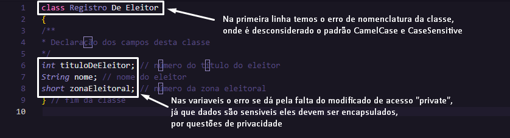

<h1 align="center"> Exercicios de Introdução ao Java 2 ☕ </h1>
<h3>Aluno: João Victor Batista de Souza</h3>
<h3>Professor: Francisco Paulo de Freitas</h3>
<br>

<h2 align="center">Exercícios da pagina 78 a 81 do Livro Introdução à Programação Orientada a Objetos</h2>
<h4 align="center">dos autores Batista & Moraes</h4>
<br>


<h2 align="center">Questão 1</h2>

<table align="center">
<thead> 
    <tr>
        <th>Tipo</th>
        <th>Nome Variavel</th>
        <th>Exemplo</th>
    </tr>
</thead>
<tbody>
  <tr>
      <th>String</th>
      <th>ID Produto</th>
      <th>#001</th>
  </tr>
  <tr>
      <th>String</th>
      <th>Nome Produto</th>
      <th>Lâmpada de Led Philips 60W</th>
  </tr>
  <tr>
      <th>String</th>
      <th>Fabricante</th>
      <th>Philips</th>
  </tr>
  <tr>
      <th>String</th>
      <th>Tipo da Lampada</th>
      <th>Led</th>
  </tr>
  <tr>
      <th>int</th>
      <th>Quantidade de Watts</th>
      <th>60W</th>
  </tr>
  <tr>
      <th>double</th>
      <th>Preço</th>
      <th>19.99</th>
  </tr>  
</tbody>
</table>

```
class Lampada {

private String idProduto;
private String nomeProduto;
private String Marca;
private String tipoLampada;
private int quantidadeWatts;
private double preco;

}
```
>codigo da class Lampada

<br>
<h2 align="center">Questão 4</h2>
<br>

>ir no repositorio na seguinte rota/caminho de pastas src > Questao4 > Questa4.java

<br>
<h2 align="center">Questão 7</h2>
 
<br>

<br>
<h2 align="center">Questão 8</h2>
 
<br>

<br>
<h2 align="center">Questao 13</h2>
<br>

>ir no repositorio na seguinte rota/caminho de pastas src > Questao13 > Main.java e as demais classes

<br>
<h2 align="center">Questão 14</h2>

>O encapsulamento desempenha um papel crucial na definição de classes, ele pode restringir o acesso direto a certos atributos ou métodos, com isso tendo um controle através dos gets e sets, protegendo assim os atributos internos

<br>

[](https://classroom.github.com/a/4j22Em04)
